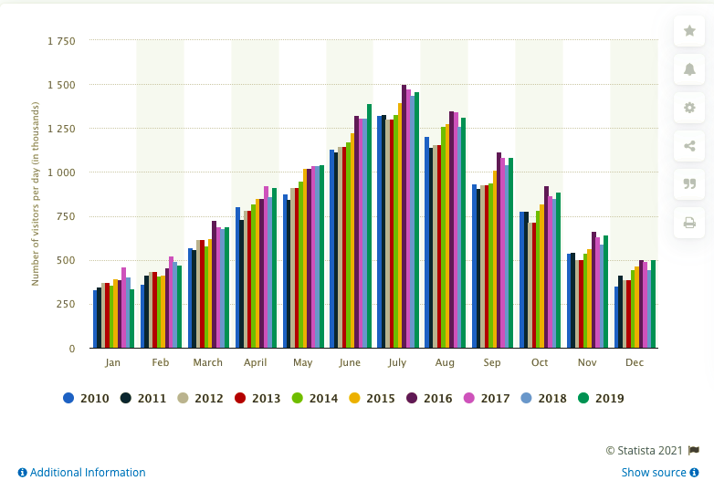
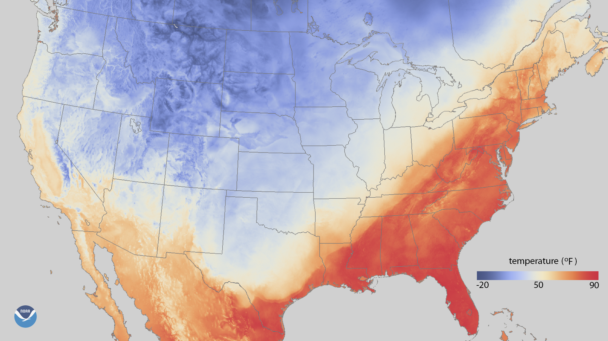

# NPS
## Project Proposal
Using python flask, we will be using a custom "creative" d3.js project. We will use d3.js to read in the [National Park Service (NPS) JSON API](https://www.nps.gov/subjects/developer/api-documentation.htm) and use leaflet to create a map of the national parks in the United States. There will be a dropdown for the user to interact with the map and choose an activity. The map will update to show which national parks have that activity. The park names, park code, latitude and longitudes, activity lists, and activity codes will be pulled from the JSON and stored using SQLite. We will use the axios javascript library to connect the backend app.py to the front end app.js.

## Group Members
- Jaime Jimenez
- Ashwini Kamat
- Mary Mays
- Lisa Stroh

## Inspiration
Some of the type of visuals we wish to show are listed below.
### Markers

### Population Graph

### Weather Style Map

## Questions to Address
- At which park can I do my favorite activities?
- What is the weather like at each park?
- How busy is a given park?
- Which national park should I visit?
